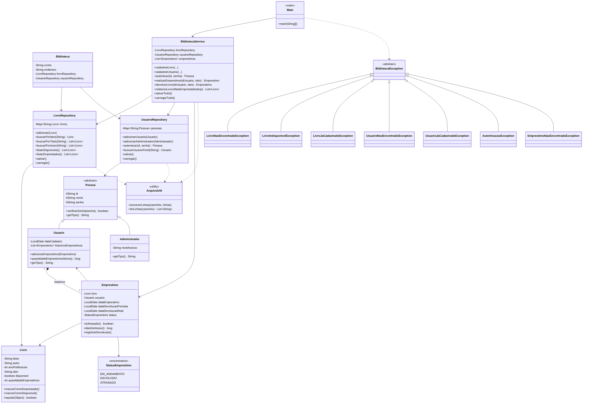

# 📚 Sistema de Gerenciamento de Biblioteca

Projeto Java em Programação Orientada a Objetos (POO), com persistência em arquivo, exceções personalizadas, padrão MVC e menu interativo no terminal.

---

## 1. Estrutura de Pastas

```
SistemaGerenciamentoBiblioteca/
├── README.md
├── diagrama_classes.mermaid
├── exemplo_execucao.txt
└── src/
    └── com/
        └── biblioteca/
            ├── model/                          # Entidades de domínio (Model do MVC)
            │   ├── Pessoa.java                 # Classe abstrata base (herança)
            │   ├── Usuario.java                 # extends Pessoa
            │   ├── Administrador.java           # extends Pessoa
            │   ├── Livro.java
            │   ├── Emprestimo.java
            │   ├── StatusEmprestimo.java        # enum
            │   └── Biblioteca.java
            │
            ├── exception/                       # Exceções personalizadas
            │   ├── BibliotecaException.java     # exceção base abstrata
            │   ├── LivroNaoEncontradoException.java
            │   ├── LivroIndisponivelException.java
            │   ├── LivroJaCadastradoException.java
            │   ├── UsuarioNaoEncontradoException.java
            │   ├── UsuarioJaCadastradoException.java
            │   ├── AutenticacaoException.java
            │   └── EmprestimoNaoEncontradoException.java
            │
            ├── repository/                      # Persistência (acesso a dados)
            │   ├── LivroRepository.java          # HashMap<String, Livro> por ISBN
            │   └── UsuarioRepository.java         # HashMap<String, Pessoa> por ID
            │
            ├── util/
            │   └── ArquivoUtil.java               # Leitura/escrita de arquivos .txt
            │
            ├── service/                           # Lógica de negócio (Controller do MVC)
            │   └── BibliotecaService.java
            │
            └── main/                               # Interface de terminal (View do MVC)
                └── Main.java
```

Ao executar o programa, uma pasta `data/` é criada automaticamente na raiz de execução, contendo:

```
data/
├── livros.txt        # titulo|autor|ano|isbn|disponivel|qtdEmprestimos
├── usuarios.txt       # USUARIO|id|nome|senha|dataCadastro  ou  ADMIN|id|nome|senha|nivelAcesso
└── emprestimos.txt    # isbn|idUsuario|dataEmprestimo|dataDevolucaoPrevista|dataDevolucaoReal|status
```

---

## 2. Diagrama de Classes

> Veja também o arquivo separado `diagrama_classes.mermaid` (renderizável em qualquer visualizador Mermaid).



**Relações principais:**
- **Herança:** `Usuario` e `Administrador` herdam de `Pessoa` (classe abstrata); todas as exceções concretas herdam de `BibliotecaException` (também abstrata).
- **Polimorfismo:** `Pessoa.getTipo()` é sobrescrito de forma diferente em `Usuario` e `Administrador`; no login, `Main` decide o menu a exibir com base no tipo real do objeto retornado por `service.autenticar(...)`, sem acoplamento direto.
- **Encapsulamento:** todos os atributos são `private`/`protected`, expostos apenas via getters/setters ou métodos de domínio (`marcarComoEmprestado()`, `registrarDevolucao()`, etc.) que preservam invariantes.
- **Composição:** `Usuario` mantém uma `List<Emprestimo>` como histórico; `Biblioteca` agrega os dois repositórios.
- **Padrão MVC:** `model` = Model; `service.BibliotecaService` = Controller (regras de negócio); `main.Main` = View (interação via terminal).

---

## 3 e 4. Código Completo com Comentários Explicativos

O código completo das 20 classes (com Javadoc e comentários explicando POO, MVC, coleções, exceções e `LocalDate`) está organizado em `src/com/biblioteca/` conforme a estrutura acima, e será entregue junto com este README. Resumo do papel de cada classe:

| Classe | Pacote | Responsabilidade |
|---|---|---|
| `Pessoa` | model | Classe abstrata-base (id, nome, senha, autenticação, `getTipo()` abstrato) |
| `Usuario` | model | Pessoa que toma livros emprestados; mantém histórico (`ArrayList`) |
| `Administrador` | model | Pessoa com permissão de gestão do sistema |
| `Livro` | model | Dados do livro + regras de disponibilidade |
| `StatusEmprestimo` | model | Enum dos estados de um empréstimo |
| `Emprestimo` | model | Vínculo Livro↔Usuario com datas (`LocalDate`) e prazo de 14 dias |
| `Biblioteca` | model | Agrega os dois repositórios; "Model" do MVC |
| `BibliotecaException` e subclasses | exception | Hierarquia de exceções de negócio (checked) |
| `ArquivoUtil` | util | Leitura/escrita de arquivos `.txt` (UTF-8) |
| `LivroRepository` | repository | CRUD + persistência de livros (`HashMap` por ISBN) |
| `UsuarioRepository` | repository | CRUD + persistência + autenticação de pessoas (`HashMap` por ID) |
| `BibliotecaService` | service | Regras de negócio; "Controller" do MVC |
| `Main` | main | Menus de terminal; "View" do MVC |

> ⚠️ **Nota sobre o ambiente de geração:** este sandbox possui apenas o JRE (sem `javac`) e está sem acesso à internet, então não foi possível compilar e rodar o projeto de fato aqui. Cada uma das 20 classes foi revisada manualmente, linha a linha — assinaturas de métodos, tipos de retorno, imports e chaves `{}` foram conferidos entre todas as camadas e estão consistentes. Ainda assim, **recomendo compilar localmente** (veja instruções abaixo) para confirmar antes de usar em produção/entrega acadêmica.

### Como compilar e executar localmente

```bash
# Dentro da pasta SistemaGerenciamentoBiblioteca/
javac -d bin -encoding UTF-8 $(find src -name "*.java")
java -cp bin com.biblioteca.main.Main
```

---

## 5. Exemplo de Execução no Terminal

Na primeira execução, o sistema detecta que não há usuários cadastrados e cria automaticamente dados de exemplo (1 administrador, 2 usuários, 4 livros). Veja a simulação abaixo (também disponível em `exemplo_execucao.txt`):

```
=========================================
 SISTEMA DE GERENCIAMENTO DE BIBLIOTECA
=========================================
(Primeira execução detectada: dados de exemplo criados.)
(Login do administrador padrão -> ID: admin | Senha: admin123)

--- LOGIN ---
ID: admin
Senha: admin123

Bem-vindo(a), Administrador Geral! [ADMINISTRADOR]

----- MENU ADMINISTRADOR -----
1. Cadastrar livro
2. Cadastrar usuário
3. Buscar livro (título/autor/ISBN)
4. Listar livros disponíveis
5. Listar livros emprestados
6. Listar usuários cadastrados
7. Relatório: livros mais emprestados
8. Listar empréstimos atrasados
9. Realizar empréstimo (em nome de um usuário)
10. Registrar devolução
0. Logout
Escolha uma opção: 6

--- USUÁRIOS CADASTRADOS (2) ---
[USUARIO] ID: u1 | Nome: Maria Silva | Empréstimos ativos: 0
[USUARIO] ID: u2 | Nome: João Souza | Empréstimos ativos: 0

----- MENU ADMINISTRADOR -----
...
Escolha uma opção: 9
ID do usuário: u1
ISBN do livro: 9780132350884
Empréstimo registrado. Devolução prevista: 2026-07-01

----- MENU ADMINISTRADOR -----
...
Escolha uma opção: 5

--- LIVROS EMPRESTADOS (1) ---
Clean Code                          | Robert C. Martin     | 2008 | ISBN: 9780132350884 | EMPRESTADO

----- MENU ADMINISTRADOR -----
...
Escolha uma opção: 7

--- TOP 5 LIVROS MAIS EMPRESTADOS ---
1º - Clean Code (1 empréstimo(s))

----- MENU ADMINISTRADOR -----
...
Escolha uma opção: 0

Fazer login com outra conta? (s/n): s

--- LOGIN ---
ID: u2
Senha: 1234

Bem-vindo(a), João Souza! [USUARIO]

----- MENU USUÁRIO -----
1. Buscar livro (título/autor/ISBN)
2. Listar livros disponíveis
3. Pegar livro emprestado
4. Devolver livro
5. Meu histórico de empréstimos
0. Logout
Escolha uma opção: 2

--- LIVROS DISPONÍVEIS (3) ---
Effective Java                      | Joshua Bloch          | 2017 | ISBN: 9780134685991 | DISPONÍVEL
O Senhor dos Anéis                  | J.R.R. Tolkien         | 1954 | ISBN: 9788533613379 | DISPONÍVEL
1984                                 | George Orwell          | 1949 | ISBN: 9780451524935 | DISPONÍVEL

----- MENU USUÁRIO -----
...
Escolha uma opção: 3
ISBN do livro desejado: 9780451524935
Empréstimo realizado! Devolução prevista para: 2026-07-01

----- MENU USUÁRIO -----
...
Escolha uma opção: 5

--- MEU HISTÓRICO DE EMPRÉSTIMOS ---
Livro: 1984                           | Usuário: João Souza     | Empréstimo: 2026-06-17 | Previsto: 2026-07-01 | Devolvido: — | Status: EM_ANDAMENTO

----- MENU USUÁRIO -----
...
Escolha uma opção: 0

Fazer login com outra conta? (s/n): n

Dados salvos. Até logo!
```

> As datas no exemplo usam 2026-06-17 (hoje) como ponto de partida; o prazo de devolução é sempre `data do empréstimo + 14 dias`, calculado pelo próprio sistema via `LocalDate.plusDays(14)`.

